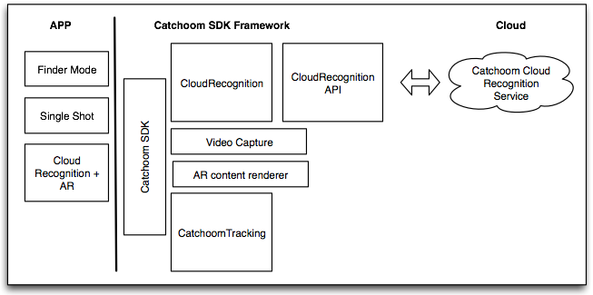
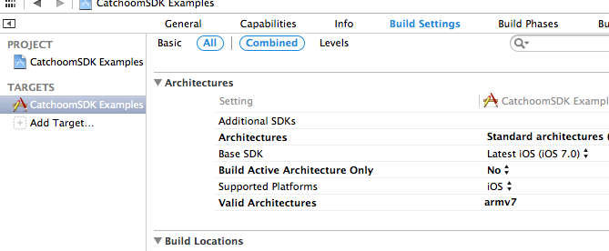
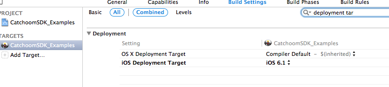
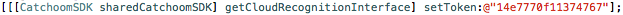
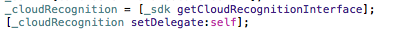
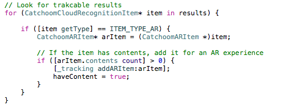

# CraftAR Mobile SDK

Table of Contents

- [1. Introduction](#1-introduction)
    - [1.1 Terminology](#11-terminology)
- [2. Features](#2-features)
- [3. Platforms](#3-platforms)
- [4. SDK architecture](#4-sdk-architecture)
- [5. SDK integration](#5-sdk-integration)
    - [5.1 Examples app](#51-examples-app)
    - [5.2 Integration on iOS native apps](#52-integration-on-ios-native-apps)
        - [Requirements](#requirements)
        - [Quick Start](#quick-start)
        - [Adding the SDK to your app](#adding-the-sdk-to-your-app)
        - [Creating your first app](#creating-your-first-app)
- [6. SDK Documentation](#6-sdk-documentation)
- [7. Frequently Asked Questions](#7-frequently-asked-questions)

* * * * *

1. Introduction
===============

Catchoom allows to create recognition only and Augmented Reality (AR)
experiences using the Catchoom Cloud Recognition Service and the
Catchoom Mobile SDK (‘Mobile SDK’).

With Catchoom, you can create amazing apps that provide digital content
for real-life objects like printed media, packaging among others. You
can use our online web panel, to upload images to be recognized and set
content to be directly drawn on top of them in your Catchoom powered
app.

This document describes mainly the Mobile SDK when used for AR. The
documentation for recognition only experiences is already available in
http://catchoom.com/documentation.

1.1 Terminology
---------------

The following is a list of concepts that are used in this document.

-   **Catchoom Cloud Recognition Service (CRS):** service that provide the
    capability to search inside the collection of images specified in a
    request, and get the content associated to that image in order to
    create an AR experience.
-   **Finder Mode:** continuously scans the camera view searching for
    objects using the Cloud Recognition Service. It can be
    programmatically started and stopped at any time. The rate of scans
    per second can also be defined.
-   **Single Shot Mode:** takes a single snapshot from the camera view. It
    is triggered programmatically.
-   **Cloud Recognition Item:** An item represents an object to be recognised. It can have one or more reference images to identify it and additional information (contents) to provide information about the item or application logic. There are two types of Recognition Items:
    -   **IR (recognition only) Items:** Intended to trigger content that is displayed at full-screen (e.g. video or product specifications) or add application logic to the image recognition (e.g. retrieve a coupon). Recognition only items can represent 2D (flat) or 3D (non-planar) objects and objects with several faces.
    - **AR item:** Augmented Reality items allow to have contents overlaid on top of the reference object once captured with a camera in the real world. Contents include images, videos, buttons among others. AR items can only have one reference image.
-   **AR view:** view that shows a mix of the real world captured with the camera and the AR content (see below) previously specified.
-   **AR content:** scene that is displayed on top of a real object (page in a catalogue, flyer, poster, etc.) that defines a custom AR experience. It is created via the CraftAR content creation tool online or API, and is stored online with a JSON format.
-   **AR content types:** built-in content types for the AR content. Currently we support image, video and image buttons.
-   **3D Object tracking:** ability to track an object in 3D to provide the right perspective for the AR view.
Tracking data: file that stores visual features to track the object in 3D.

2. Features
===========

The Mobile SDK provides the following features:

-   **Camera capture management:** Abstraction of the camera capture and
    preview.
-   **Cloud Recognition:** action taken when an image is sent to the
    Catchoom Cloud Recognition Service (CRS) via API. Cloud Recognition
    can be used in two modes: Finder Mode and Single Shot Mode.
-   **3D Object Tracking**
-   **AR content rendering in AR view**
-   **Automatic download of AR content stored online:** upon recognition,
    the SDK automatically requests the necessary assets from Catchoom
    service. Those assets are the Tracking data and the AR content.
-   **AR content description parser:** processes the information stored in
    the JSON of the AR content. The parser can load the AR content
    automatically into the AR view, and display them when the item’s
    reference image is tracked correctly.
-   **AR content type extension:** ability to extend programmatically the
    built-in contents with ad hoc content types.


3. Platforms
============

The Catchoom SDK is currently provided only for iOS. An Android version
will be coming soon.

4. SDK architecture
===================

The Catchoom SDK is structured in a modular way that allows the
developer to choose which parts to use for their application.

The following figure depicts the architecture of the SDK with the
different modules involved.



[](#)[](#)

| Classes                              | Functionality                        |
|--------------------------------------|--------------------------------------|
| CatchoomSDK                          | Main interface that manages the video capture and the rendering.|
| | |
| Video capture                        | Takes control over the camera and allows to attach the search and tracking modules to process the video frames.  |
| | |
| CloudRecognition                     | Connects to the CRSConnect to perform image recognition queries.|
|| This module allows to search with images from the video capture in two modes:|
||- Finder Mode: Send video frames to the CRS as they are received from the video capture.|
||- Single shot: Take a picture and send it to the CRS.              |
||This module handles the CRS response and provides the resulting items in an easy to access class.      |       
||Items can be extended to parse custom fields.                       |
| | |
| CRSConnect                           | Manages network calls to the Cloud Recognition Service API. Can be extended to use a proxy server and custom parsing of the responses.     |
| | |
| CatchoomTracking                     | Manages the augmentation process:    |
|                                      | -   Manages AR items: Add/remove images (AR items) that will be used as the patterns to detect and augment for the AR experiences.                     |
|                                      | -   Manages AR content: To be drawn on top of the item image when detected in the video capture.   |
|                                      | -   Tracking: Processing of video frames for 3D object tracking.   |
| | |
| CatchomRenderer                      | Draw the camera preview and different types of AR content in the AR view: |
| | -   Image                            |
| | -   Videos                           |
| | -   Image buttons                    |

5. SDK integration
==================

Steps for integrating your mobile app with Catchoom and create cool AR
experiences with the Catchoom SDK:

1.  Create an account at the Catchoom AR Service beta.
2.  Download the Catchoom SDK for iOS.
3.  Follow the Quick start guide for iOS to integrate the SDK with your
    app.
4.  Create a collection and add some AR items with content.

Also you can test our example app and see how we integrated the SDK.
Note that the CatchoomSDK.framework takes over 127 MB of disk space, but
in your app this will only add around 2MB.

5.1 Examples app
----------------

The SDK distribution comes with an xCode project of an application with
examples on how to use the SDK. These examples show how to start a
camera preview, start the CRS search in Finder Mode and when some result
is found, start tracking with contents created locally and parsed from
the scene description.

To run the examples follow these steps:

1.  Open the CatchoomSDK_Examples.xcodeproj project.
2.  Select an iOS 6 or 7 device (Notice that the project will not
    compile for the simulator).
3.  Hit the run button.

5.2 Integration on iOS native apps
----------------------------------

### Requirements

To build the project or use the library, you will need XCode 5 or newer,
and at least the iOS 5.0 library.

### Quick Start

The easiest way to get started with the Catchoom SDK is by using the
example application. The example app includes a compiled version of the
AFNetworking framework (used to connect to the Cloud Recognition API)
and all dependencies are already added to the project.

### Adding the SDK to your app

The iOS Catchoom SDK is distributed as a .framework that you can
directly drag into your project. It has some dependencies on
frameworks/libraries that have to be linked and some compilation
settings to be set. To proceed with the integration follow the steps
below.

##### Add the other framework and library dependencies to your project:

-   AVFoundation
-   CoreMedia
-   libstdc++.dylib
-   SystemConfiguration
-   MobileCoreServices

##### Import everything provided in the CathoomSDK directory:

-   CatchoomSDK.framework (framework library with the catchoom SDK)
-   CatchoomSDK.bundle (bundle resources for the SDK)
-   AFNetworking.framework (Network library used by the CatchoomSDK, we
    provide a compiled version from the [AFNetworking
    project](https://github.com/AFNetworking/AFNetworking), version
    2.0.3)

##### Set the Build Settings to produce a CatchoomSDK compatible app.

-   Build Active Architecture Only → NO
-   Valid Architectures → armv7 (other architectures are not supported
    on this version).
-   In the Packaging section set the Compress PNG files option to No.
-   Set the deployment target to iOS 6.1

[](#)[](#)







### Creating your first app

Once you have set up your project, it’s time to add code to start using
the Catchoom SDK. There are four steps to do so:

1.  Set up your token for the Cloud Recognition
    Service:

2.  Set a preview view for the camera capture, you need to provide a
    UIView referenced in your storyboard and linked to your
    ViewController:
    

    **Note:** the ‘videoPreviewView’ you provide will be loaded with a rendering
    view and no other subviews will be displayed for it. If you need to
    display other views as part of this ViewController, add them to
    self.view of the ViewController where you add ‘videoPreviewView’.

3.  Start using the CloudRecognition Interface:

    a. Use the CatchoomCloudRecognitionProtocol to receive search
    responses:
    
    b. Start searching for objects to recognize from the camera
    capture
    
    c. Implement the results callback to receive tracking data and
    contents:

4.  Start the augmented reality experience:

    a. Get the tracking interface:
    
    **Note:** this step needs the preview to be initialized. Otherwise, the sdk
    will return nil.
    
    b. Obtain the AR items and add them to the tracking
    module:
    
    c. Start tracking:

6. SDK Documentation
====================

Complete SDK documentation of the classes can be found within the SDK
distribution in the Documentation folder.

7. Frequently Asked Questions
=============================

#### Can I add a proxy server between the Catchoom CRS and my app?

Yes, you can. In iOS you can extend the CRSConnect class and change the
url it points to, then you just need to tell the SDK to use it instead
of the CRSConnect.

#### Can I limit the number of searches per second during continuous scan?

Yes, you can do it through the CatchoomCloudRecognition interface:

```[\_crs setMaximumSearchesPerSecond: 1.0];```

with a float number in the range 0 \< n \<= 2.0.


#### Can I run the app in the simulator?

Currently the simulator is not supported. Our libraries depend on
devices that have built in camera and the simulator does not have one.


#### Should/Can I call ```[_tracking startTracking];``` if it has already been called once? Does it continue tracking or it stops and starts? Will the videoplayback restart or continue?

The call will have no effect. If the tracking has already started, the
SDK will continue with the tracking on.


#### Can I run Finder Mode and tracking simultaneously?

Yes, but you must manage your AR items. You must control the AR items
and the contents you add in order not to add the same item again or load
the content several times when an item being tracked is found by the
Finder Mode.

